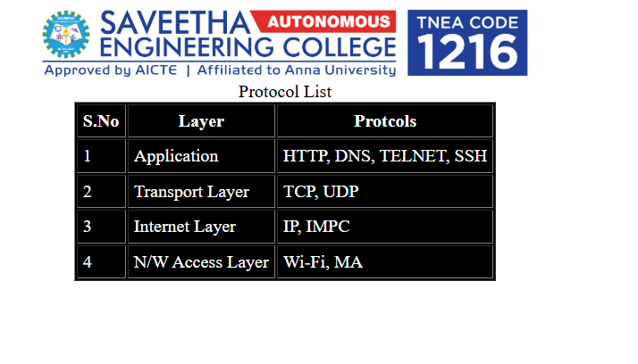

# EX01 Developing a Simple Webserver
## Date:5/4/2025

## AIM:
To develop a simple webserver to serve html pages and display the list of protocols in TCP/IP Protocol Suite.

## DESIGN STEPS:
### Step 1: 
HTML content creation.

### Step 2:
Design of webserver workflow.

### Step 3:
Implementation using Python code.

### Step 4:
Import the necessary modules.

### Step 5:
Define a custom request handler.

### Step 6:
Start an HTTP server on a specific port.

### Step 7:
Run the Python script to serve web pages.

### Step 8:
Serve the HTML pages.

### Step 9:
Start the server script and check for errors.

### Step 10:
Open a browser and navigate to http://127.0.0.1:8000 (or the assigned port).

## PROGRAM:

```
<html>
    <body>
        <center>
        
        </center>
        <table border="1" align="center" cellpadding="5px" bgcolor="black">
            <caption>Protocol List</caption>
            <tr style="color: white;">
                <th>S.No</th><th>Layer</th><th>Protcols</th>
            </tr>
            <tr style="color: white;">
                <td>1</td><td>Application</td><td>HTTP, DNS, TELNET, SSH</td>
            </tr>
            <tr style="color: white;">
                <td>2</td><td>Transport Layer</td><td>TCP, UDP</td>
            </tr>
            <tr style="color: white;">
                <td>3</td><td>Internet Layer</td><td>IP, IMPC</td>
            </tr>
            <tr style="color: white;">
                <td>4</td><td>N/W Access Layer</td><td>Wi-Fi, MA</td>
            </tr>
        </table>
    </body>
</html>
```


class myhandler(BaseHTTPRequestHandler):      
     def do_GET(self):
     
        print("request received")

        self.send_response(200)
        self.send_header('content-type', 'text/html; charset=utf-8')

        self.end_headers()
        self.wfile.write(content.encode())

server_address = ('',8000)

httpd = HTTPServer(server_address,myhandler)

print("my webserver is running...")

httpd.serve_forever()


## OUTPUT:



## RESULT:
The program for implementing simple webserver is executed successfully.
